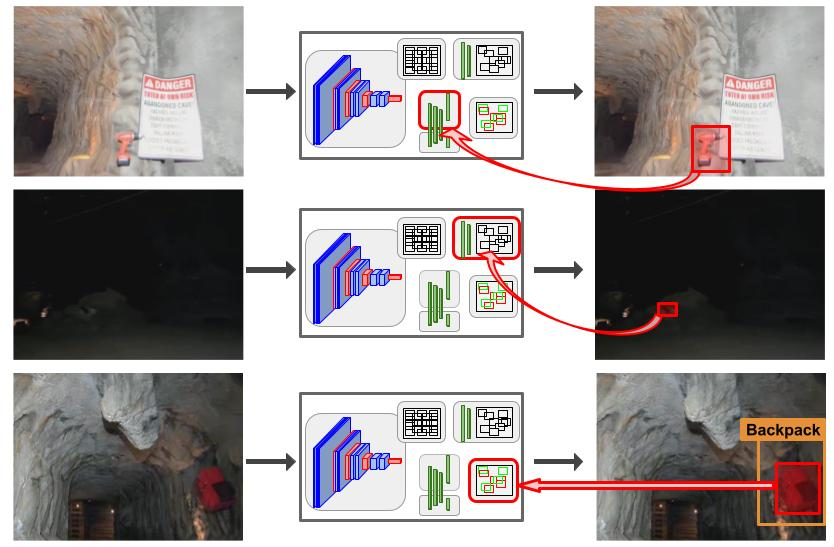

# What's in the Black Box? The False Negative Mechanisms Inside Object Detectors

**This paper has very recently been accepted to IEEE Robotics and Automation Letters, and accepted for presentation at IROS 2022. All code will be online within the next week (by July 8).**

This is the official repository of paper:

**[What's in the Black Box? The False Negative Mechanisms Inside Object Detectors](https://arxiv.org/abs/2203.07662)**

*Dimity Miller, Peyman Moghadam, Mark Cox, Matt Wildie, Raja Jurdak*

<!--  -->
<p align="center">
  
</p>

If you use this repository, please cite:

```text
@article{miller2022s,
  title={What's in the Black Box? The False Negative Mechanisms Inside Object Detectors},
  author={Miller, Dimity and Moghadam, Peyman and Cox, Mark and Wildie, Matt and Jurdak, Raja},
  journal={arXiv preprint arXiv:2203.07662},
  year={2022}
}
```

**Contact**

If you have any questions or comments, please contact [Dimity Miller](mailto:d24.miller@qut.edu.au).

## Installation

This code was developed with Python 3.8 on Ubuntu 20.04. 

Our paper is implemented for Faster R-CNN and RetinaNet object detectors from the [detectron2 repository](https://github.com/facebookresearch/detectron2). We recommend you also use detectron2 repository, but also include a general script for identifying false negative mechanisms independent of the detector implementation (more details in the **Testing** section).

**Clone and Install Detectron2 Repository**
1. Clone [detectron2](https://github.com/facebookresearch/detectron2) inside the fn_mechanisms folder.
```bash
cd fn_mechanisms
git clone https://github.com/facebookresearch/detectron2.git
```
2. Follow the [detectron2 instructions for installation](https://detectron2.readthedocs.io/en/latest/tutorials/install.html). We use pytorch 1.12 with cuda 11.6, and build detectron2 from source. However, you should be able to use other versions of pytorch and cuda as long as they meet the listed detectron2 requirements.
3. You should be able to run the following command with no errors. If you have any errors, this is an issue with your detectron2 installation and you should debug or raise an issue with the detectron2 repository.
```bash
cd detectron2/demo
python demo.py --config-file ../configs/COCO-Detection/faster_rcnn_R_50_FPN_3x.yaml --input images/test_im.jpg --opts MODEL.WEIGHTS https://dl.fbaipublicfiles.com/detectron2/COCO-Detection/faster_rcnn_R_50_FPN_3x/137849458/model_final_280758.pkl
```

## Acknowledgement
This code builds upon the [detectron2 repository](https://github.com/facebookresearch/detectron2). Please also acknowledge detectron2 if you use their repository.
